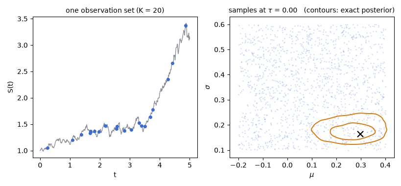
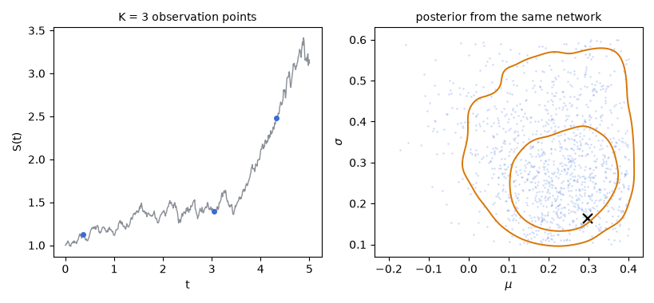

# amortix

Amortized Bayesian parameter recovery for dynamical systems, in pure Python on top of PyTorch.

Given a prior over the parameters of an ODE/SDE/PDE model and a simulator, `amortix` trains a
posterior approximator once, by conditional flow matching: a transformer set-encoder reads the
observed points and conditions a velocity field that transports Gaussian noise to the posterior.
After training, inference for any new observation set is a single batched ODE solve — about 70 ms
for 4,000 posterior draws on one GPU, under a second on a laptop CPU. The method is that of
[Bayesian Inverse Problems Meet Flow Matching](https://arxiv.org/abs/2503.01375) (Sherki,
Oseledets, Muravleva); the same recipe applied to bioprocess calibration is
[arXiv:2604.22496](https://arxiv.org/abs/2604.22496).

<p align="center"></p>

<p align="center"><em>Posterior sampling is one ODE solve: 1,500 samples carried from Gaussian noise
to the posterior by the learned velocity field (blue), against the exact posterior for the same
observed points (orange contours; geometric Brownian motion, animation by
<code>docs/make_animations.py</code>).</em></p>

## Installation

```bash
uv pip install git+https://github.com/oseledets/amortix.git
```

`amortix cases` then lists the built-in cases as a smoke test. From a clone the same command is
`uv pip install -e .`.

## Quick example

Recover the two parameters of geometric Brownian motion and compare the sampled posterior with
the exact one on the same observed points (a few minutes on a laptop CPU):

```python
import torch
from amortix.evaluation import fid, model_of_size
from amortix.problems.design_basic import GBMDesign, gbm_exact_from_points

prob = GBMDesign()                        # dX = mu X dt + sigma X dW, uniform prior
post = model_of_size(prob, "tiny")
post.fit(n_train=3000, steps=1200, batch=256,
         retokenize=prob.make_retokenizer())

gen = torch.Generator().manual_seed(1)
m_true = prob.prior.sample(1, gen)        # one synthetic observation set
raw = prob.trajectories(m_true, gen)
tidx, cidx = prob.sample_design(gen, 20)  # 20 observation points at random times
tokens = prob.tokens_for(raw[0], tidx, cidx, gen)

draws = post.sample(tokens, n=2000)       # posterior draws, milliseconds
exact = gbm_exact_from_points(prob, raw[0, :, 0], tidx, n_samples=2000)
print(fid(draws.numpy(), exact))          # distance to the exact posterior
```

The trained network is *design-amortized*: it accepts any number of observation points at
arbitrary times (and sensors), so the 20 points above can be 5 or 100 without retraining. The
production configuration used for the numbers in the technical report is one line away:

```python
from amortix import FlowPosterior, DESIGN_ZOO

prob = DESIGN_ZOO["heston"]()             # or any DesignProblem subclass
post = FlowPosterior(prob)
post.fit(n_train=120_000, steps=72_000,   # about 1 h on one GPU
         retokenize=prob.make_retokenizer())
```

<p align="center"></p>

<p align="center"><em>One trained network, queried with 3 to 100 observation points of the same path:
each query is milliseconds, and the posterior tracks the exact one (orange contours) recomputed
for every design.</em></p>

Four worked examples, each self-contained and commented, are in the
[gallery](examples/gallery/): every one produces a figure and is checked against a reference
that is not the flow — an exact posterior, exact-likelihood MCMC, or recovery of the
generating parameters on held-out instances.

## Your own ODE, step by step

Every system enters the package through the same contract: a prior box, a simulator, and an
observation grid. The complete path from a new ODE to a calibration-checked posterior follows,
for a damped oscillator $\ddot x = -\omega^2 x - 2\gamma \dot x$ with unknown frequency and
damping; the assembled script is
[`examples/gallery/04_custom_problem.py`](examples/gallery/04_custom_problem.py).

**Step 1 — the prior.** A uniform box over the parameters, with names used in printouts and
plots:

```python
from amortix.prior import BoxUniform

prior = BoxUniform(low=[0.5, 0.05], high=[3.0, 0.5], names=["omega", "gamma"])
```

For a positive scale parameter whose prior spans orders of magnitude, put its logarithm in the
box and exponentiate inside the simulator.

**Step 2 — the simulator.** Subclass `DesignProblem`. The `DesignObserver` declares the
simulation grid (`dt_sim`, `n_steps`) and the largest observation design the network will be
trained for (`k_max`); `trajectories` integrates a batch of parameter vectors `m` of shape
`[B, d]` into paths of shape `[B, n_steps + 1, n_channels]` — here a symplectic-Euler loop,
but any integrator (or a call into your own solver) works:

```python
import torch
from amortix.designs import DesignObserver, DesignProblem

class DampedOscillator(DesignProblem):
    obs_noise = 0.05                       # additive Gaussian measurement noise

    def __init__(self):
        self.prior = BoxUniform(low=[0.5, 0.05], high=[3.0, 0.5],
                                names=["omega", "gamma"])
        self.observer = DesignObserver(dt_sim=0.05, n_steps=400, k_max=64)
        self.k_min = 4                     # smallest design seen in training

    def trajectories(self, m, generator=None):
        om, ga = m[:, 0], m[:, 1]
        x = torch.ones(m.shape[0]); v = torch.zeros(m.shape[0])
        out = torch.zeros(m.shape[0], 401, 1); out[:, 0, 0] = x
        dt = self.observer.dt_sim
        for i in range(400):
            a = -(om ** 2) * x - 2.0 * ga * v
            v = v + dt * a
            x = x + dt * v
            out[:, i + 1, 0] = x
        return out
```

Conventions worth stating explicitly. `obs_noise` is additive Gaussian in raw signal units,
applied at tokenization (a fresh draw at every call); a multiplicative log-normal option exists
(`LOGSD`), and an unknown noise level is handled by making it one more parameter in the prior
box. `k_max` is both the transformer's sequence length (compute per query) and the hard ceiling
on the design sizes the network is trained for; training draws design sizes between `k_min` and
`k_max`, and querying above `k_max` is unsupported.

For an SDE the contract is identical — draw the noise from `generator` inside `trajectories`
(see `GBMDesign` in `amortix/problems/design_basic.py` for a ten-line example). A system with
several observed components sets `n_channels` in the observer and fills the last axis; a token
is one scalar reading of one channel at one time, so to observe the oscillator's velocity as
well, declare `DesignObserver(..., n_channels=2)` and write `out[:, i + 1, 1] = v`. Components
that are never measured are simply not channels — they stay internal to `trajectories`, which is
how a latent state (the E compartment of an SEIR model, the volatility of a stochastic-volatility
model) enters the problem.

**Step 3 — training.** Tokenization, the design-size law, and fresh designs at every optimizer
step are inherited from the base class; the only choices are the model size and the budget:

```python
from amortix.evaluation import model_of_size

prob = DampedOscillator()
post = model_of_size(prob, "tiny")         # pico/nano/tiny/small/big
post.fit(n_train=3000, steps=1200, batch=256,
         retokenize=prob.make_retokenizer(), verbose=True)

torch.save(post.state_dict(), "oscillator.pt")          # reuse across sessions:
# post = load_posterior(prob, "oscillator.pt")          # amortix.evaluation
```

The named sizes are (width, depth) presets of the encoder and velocity field:

| size | dim, depth | parameters |
|---|---|---|
| `pico` | 8, 2 | 8k |
| `nano` | 16, 2 | 27k |
| `tiny` | 32, 2 | 98k |
| `small` | 64, 3 | 484k |
| `big` | 128, 4 | 2.3M |

At the budget above, `tiny` fits in a few minutes on a laptop CPU; the technical report's numbers
use `big` at forty times this budget, about an hour on one GPU. `verbose=True` prints the running
flow-matching loss; it converges to a positive plateau, because the loss estimates a squared
distance whose minimum is the intrinsic variance of the velocity target, and that minimum is
not zero.

**Step 4 — inference, at any design.** The trained network answers for any number of
observation points at arbitrary times; each query is one batched ODE solve:

```python
gen = torch.Generator().manual_seed(3)
m_true = prob.prior.sample(1, gen)
raw = prob.trajectories(m_true, gen)
tidx, cidx = prob.sample_design(gen, 12)   # 12 points at random times
draws = post.sample(prob.tokens_for(raw[0], tidx, cidx, gen), n=2000)
print(draws.mean(0), draws.std(0))         # posterior mean and sd vs m_true
```

Measured data enter the same way, without a simulated path: build the token tensor directly
from times (in the simulator's time units), values (raw signal units), and, for multi-channel
systems, a channel index per reading:

```python
from amortix import tokens_from_data

tokens = tokens_from_data(prob, times=[0.4, 1.1, 2.6, 7.3, 9.0],
                          values=[0.71, -0.32, 0.18, -0.09, 0.05])
draws = post.sample(tokens, n=2000)
```

**Step 5 — the check.** Where a tractable likelihood exists, compare against a reference
posterior: `amortix.evaluation.build_eval_set` freezes an evaluation set with two independent
reference chains, and `evaluate` scores any posterior against it (the pattern of
[`03_exact_reference_cir.py`](examples/gallery/03_exact_reference_cir.py)). Every evaluation set
carries its own resolution floor — the FID between its two independent reference chains — and a
median FID within a few multiples of that floor is indistinguishable from the reference at that
evaluation size. Without a tractable likelihood, check recovery on held-out simulated instances:
the posterior should cover the generating parameters, and its width should shrink as observation
points are added (the pattern of
[`02_any_design_pk.py`](examples/gallery/02_any_design_pk.py)).

## What is inside

- **Problem contract.** A `Problem` is a prior, a simulator, and an observation spec.
  `SDEProblem` builds the simulator from a drift and a diffusion (Euler–Maruyama, vector state,
  correlated noise); `ODEProblem` from a right-hand side (batched RK4). Adding a system means
  writing these functions and a prior box; see `04_custom_problem.py`.
- **Posterior model.** `FlowPosterior` combines a SetTransformer encoder (RoPE attention over
  observation tokens, so irregular sampling is native) with a conditional-flow-matching velocity
  field and an ODE sampler.
- **Benchmark suite.** Fourteen systems with validated reference posteriors: linear-Gaussian,
  geometric Brownian motion, Ornstein–Uhlenbeck, Cox–Ingersoll–Ross, double well,
  polynomial-drift SDE, stochastic Lotka–Volterra, Heston, Merton jump-diffusion, SEIR,
  FitzHugh–Nagumo, Hodgkin–Huxley, pharmacokinetics, and a Fisher–KPP reaction–diffusion PDE.
  References are exact where a closed form exists and are otherwise computed by adaptive MCMC,
  with particle-filter likelihoods where the transition density is intractable; the validation
  of every reference, including nested-sampling and tempered-SMC cross-checks, is described in
  the technical report.
- **Evaluation.** Accuracy is the Fréchet distance between the sampled and reference posteriors
  on frozen evaluation sets; the same machinery is
  exposed for user-defined problems (`amortix.evaluation`).

## Technical report

Architecture, training recipe, evaluation methodology, the benchmark suite with its reference
posteriors, and measured training/inference costs are documented in the technical report:
[`report/techreport.pdf`](report/techreport.pdf).

## References

1. C. Sherki, I. Oseledets, E. Muravleva. *Bayesian Inverse Problems Meet Flow Matching:
   Efficient and Flexible Inverse Problem Solving*. [arXiv:2503.01375](https://arxiv.org/abs/2503.01375).
2. D. Fokina, M. Baldan, C. Romankiewicz, W. Laudensack, R. Ulber, M. Bortz. *Deep Learning for
   Model Calibration in Simulation of Itaconic Acid Production*.
   [arXiv:2604.22496](https://arxiv.org/abs/2604.22496).

## License

MIT.
