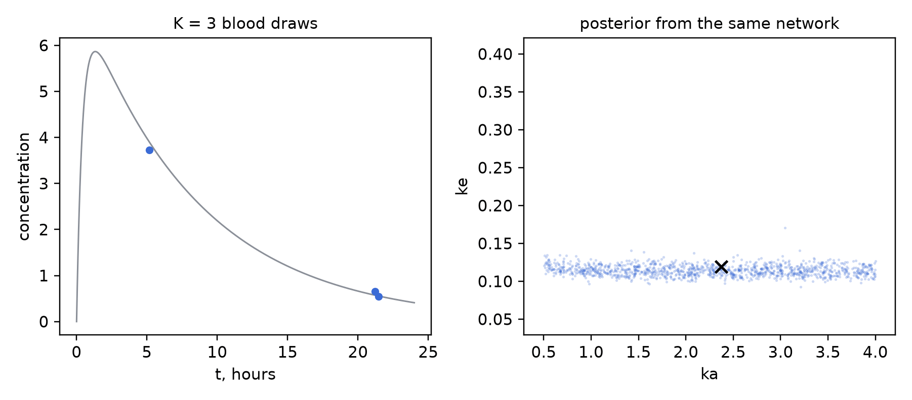
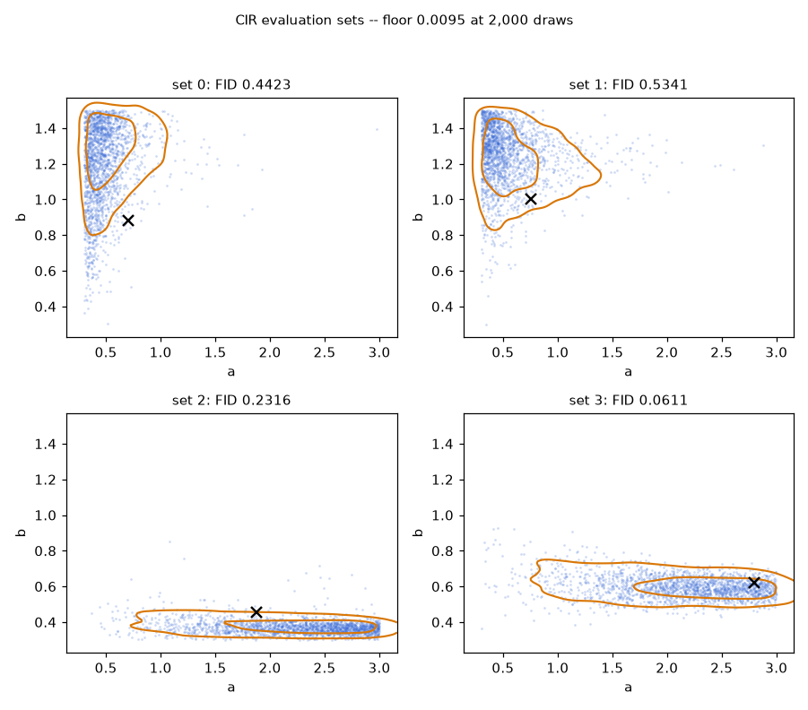
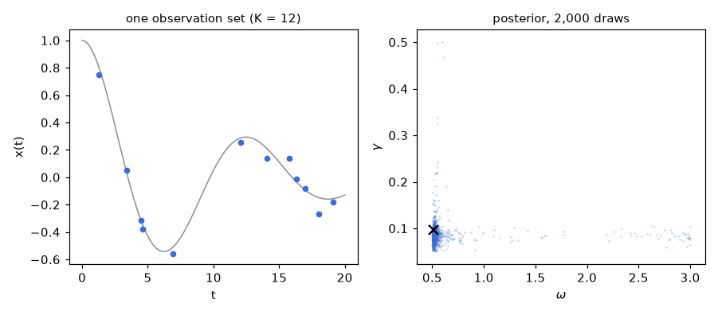

# Gallery

Every example is self-contained, runnable from the repository root, and checked against a
reference that is not the flow: an exact posterior, exact-likelihood MCMC with two independent
chains, or recovery of the generating parameters on held-out data. Budgets are deliberately
small — the scripts show the API in minutes on a laptop CPU, while the technical report's tables
use roughly forty times these budgets. Shrunk versions of the examples are pinned by
[`tests/test_examples.py`](../../tests/test_examples.py); each script re-renders its own figure
with `--png` and caches its trained model with `--ckpt PATH`.

<table>
<tr>
<td width="50%">
 
<b><a href="pages/quickstart_gbm.md">quickstart_gbm</a></b> (<a href="01_quickstart_gbm.py">code</a>) —
geometric Brownian motion dS = &mu;S&thinsp;dt + &sigma;S&thinsp;dW recovered from 20 points at
random times, with the whole interface written out in the file: prior box, simulator loop,
observation grid. The tiny posterior of this run reaches FID 0.028 against the exact posterior
on the same points, where the 2,000-draw sampling floor is about 0.004.
<i>Reference: the exact conjugate posterior, in closed form.</i>
</td>
<td width="50%">
 
<b><a href="pages/any_design_pk.md">any_design_pk</a></b> (<a href="02_any_design_pk.py">code</a>) —
one-compartment pharmacokinetics (Bateman curve with log-normal assay noise, defined in the
file) observed at 3 to 64 arbitrary times by one network, with no retraining between designs:
the animation adds blood draws to the same record and the posterior tightens around the truth;
tokens are built with <code>tokens_from_data</code>, the entry point for measured data.
<i>Reference: recovery of the truth across designs, with monotone width shrinkage pinned by the
test suite.</i>
</td>
</tr>
<tr>
<td>
 
<b><a href="pages/exact_reference_cir.md">exact_reference_cir</a></b> (<a href="03_exact_reference_cir.py">code</a>) —
the full evaluation protocol on Cox–Ingersoll–Ross: a frozen evaluation set of four observation
instances, each with two independent exact-likelihood MCMC chains, whose disagreement sets the
set's own resolution floor (0.0095 at 2,000 draws); the small model of this run scores a median
FID of 0.34 against it.
<i>Reference: exact-likelihood adaptive MCMC, two chains per instance.</i>
</td>
<td>
 
<b><a href="pages/custom_problem.md">custom_problem</a></b> (<a href="04_custom_problem.py">code</a>) —
a user-defined system in ~25 lines: a damped oscillator with unknown frequency and damping,
observed at 12 noisy points; the posterior concentrates at the truth, with a thin tail of
high-frequency aliases that sparse designs cannot exclude.
<i>Reference: recovery of the generating parameters; with a tractable likelihood,
build_eval_set gives the direct comparison.</i>
</td>
</tr>
</table>

## All examples

| example | shows | reference | runtime (CPU) |
|---|---|---|---|
| [quickstart_gbm](pages/quickstart_gbm.md) ([code](01_quickstart_gbm.py)) | train + sample + score against an exact posterior | exact conjugate posterior | ~10 min |
| [any_design_pk](pages/any_design_pk.md) ([code](02_any_design_pk.py)) | one network, any number of observation points | truth recovery across designs | ~40 min |
| [exact_reference_cir](pages/exact_reference_cir.md) ([code](03_exact_reference_cir.py)) | frozen evaluation sets, validated references, resolution floors | exact-likelihood MCMC, two chains | ~30 min |
| [custom_problem](pages/custom_problem.md) ([code](04_custom_problem.py)) | add your own system in ~25 lines | truth recovery | ~10 min |

Runtimes are one laptop CPU, indicative only; `--ckpt` makes any re-run seconds. The two
animations on the front page are produced by [`docs/make_animations.py`](../../docs/make_animations.py)
from the same machinery.
