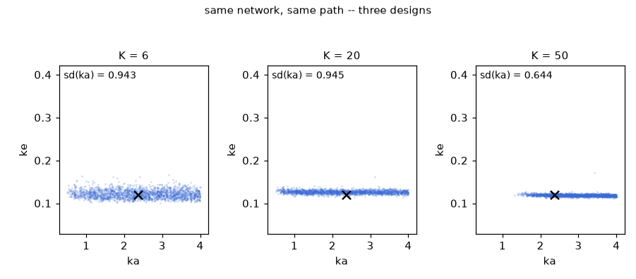

# One trained network answers every blood-draw design from 3 to 64 points

Pharmacokinetic blood draws are the archetype of irregular observation designs: a concentration curve sampled at whatever times the protocol produced, in whatever number. The problem — an oral one-compartment Bateman curve with log-normal assay noise — is defined inline in the example script as a class of about 20 lines, and a `small` design-amortized posterior (width 64, three transformer blocks) is trained on it once, with 20,000 simulated records and 6,000 optimizer steps. The same trained network is then queried on one fixed record at $K = 6$, 20 and 50 draws: the posterior standard deviation of the volume $V$ falls 11.7 → 4.7 → 2.2 and that of the elimination rate $k_e$ falls 0.0094 → 0.0038 → 0.0026, each design size a fresh query with its own token set.


*Left: the Bateman concentration curve of the seed-7 record (grey) with blood draws accumulating from $K = 3$ to $K = 64$ (blue). Right: 1,200 draws from the same trained network in the $(k_a, k_e)$ plane; the black cross marks the generating parameters. The permutation of sampling times and the assay noise are drawn once, so each frame shows the network a longer prefix of the same noisy record; the cloud collapses in $k_e$ within the first frames and yields in $k_a$ only near the end.*

## The problem

$$C(t) = \frac{D\,k_a}{V\,(k_a - k_e)}\left(e^{-k_e t} - e^{-k_a t}\right), \qquad C(0) = 0, \quad D = 500,$$

an oral one-compartment model: the drug is absorbed from the gut at rate $k_a$, eliminated from plasma at rate $k_e$, and dilutes in a volume of distribution $V$. The prior is a uniform box $k_a \in [0.5,\ 4.0]$, $k_e \in [0.05,\ 0.40]$, $V \in [20,\ 100]$; the two rate boxes are disjoint, so $k_a - k_e \ge 0.1$, the denominator never vanishes, and absorption is always the faster of the two processes. The simulator — the `PK` class written out in [`02_any_design_pk.py`](../02_any_design_pk.py) and shown below — evaluates the curve on a 24-hour grid of 500 steps ($dt = 24/500 = 0.048$ h, time in hours) in one closed-form expression: deterministic given the parameters, no integration loop.

An observation set (a *design*) is $K$ grid times drawn uniformly at random and time-sorted — the blood draws — with the class declaring the admissible range $3 \le K \le 64$ (`k_min`, `k_max`); this run queries $K = 6$, 20 and 50. Each assay carries multiplicative log-normal noise: the observed value is $C(t)\,e^{0.10\,z}$ with $z$ standard normal, an error of about 10%, applied by the base class whenever an observation is tokenized. The class attribute `LOGSD = 0.10` is the entire declaration of this convention.

## The code, walked through

The central exhibit is the problem definition itself, complete in the script:

```python
class PK(DesignProblem):
    """C(t) = D ka / (V (ka - ke)) (e^{-ke t} - e^{-ka t}), noisy assays."""

    DOSE = 500.0
    LOGSD = 0.10                # multiplicative log-normal measurement noise

    def __init__(self):
        self.prior = BoxUniform(low=[0.5, 0.05, 20.0],
                                high=[4.0, 0.40, 100.0],
                                names=["ka", "ke", "V"])
        self.observer = DesignObserver(dt_sim=24.0 / 500.0, n_steps=500,
                                       k_max=64)
        self.k_min = 3

    def trajectories(self, m, generator=None):
        tg = torch.arange(self.observer.n_steps + 1,
                          dtype=torch.float32) * self.observer.dt_sim
        ka, ke, V = m[:, 0:1], m[:, 1:2], m[:, 2:3]
        c = (self.DOSE * ka / (V * (ka - ke))
             * (torch.exp(-ke * tg[None]) - torch.exp(-ka * tg[None])))
        return c[..., None]
```

`BoxUniform` is the prior; `DesignObserver` records the grid metadata (step size, number of steps, largest design size). `trajectories` maps a `[B, 3]` parameter batch to `[B, 501, 1]` concentration curves; the `generator` goes unused because the curve is deterministic — all randomness enters through the assay noise, at observation time.

Training is one `fit` call at the `small` named size (width 64, three transformer blocks), the largest budget in the gallery:

```python
post = model_of_size(prob, "small")
post.fit(n_train=20000, steps=6000, batch=256,
         retokenize=prob.make_retokenizer(), verbose=True)
```

The 20,000 training records are simulated once; at every optimizer step the retokenizer re-observes each record in the batch through a fresh random design — a new size $K$ from the package's mixed size law on $[3, 64]$ (half log-uniform, half uniform over the dense half $[32, 64]$), new uniformly random times, and a new draw of the assay noise. Each observation becomes a six-feature token $[\,t/T,\ y,\ 0,\ 0,\ \log K/\log K_{\max},\ \text{channel}\,]$; the $\log K$ feature carries the design size.

The query loop fixes one parameter draw and one clean curve by seed, then interrogates it through three designs:

```python
gen = torch.Generator().manual_seed(7)
m_true = prob.prior.sample(1, gen)
raw = prob.trajectories(m_true, gen)
for K in (6, 20, 50):
    tidx, cidx = prob.sample_design(gen, K)
    tokens = prob.tokens_for(raw[0], tidx, cidx, gen)
    d = post.sample(tokens, n=2000)
    lo, hi = d.quantile(0.05, 0), d.quantile(0.95, 0)
    inside = bool(((m_true[0] >= lo) & (m_true[0] <= hi)).all())
```

`sample_design` draws $K$ grid times, `tokens_for` reads the curve there, applies the log-normal assay noise, and packs the tokens; `post.sample` returns 2,000 posterior draws conditioned on them. The network is the same object in all three passes — $K$ enters only through the token set. The `inside` flag is joint: it asks whether all three parameters fall between the 5% and 95% posterior quantiles simultaneously.

The animation is built differently, through `tokens_from_data`:

```python
gen = torch.Generator().manual_seed(11)
perm = torch.randperm(obs.n_steps, generator=gen) + 1
times = perm.float() * obs.dt_sim
noise = torch.randn(obs.n_steps, generator=gen)
y = raw[0, perm, 0] * torch.exp(prob.LOGSD * noise)   # noisy assays, once

ks = [3, 4, 6, 8, 11, 15, 20, 27, 36, 48, 64]
# per frame:
tokens = tokens_from_data(prob, times[:k], y[:k])
d = post.sample(tokens, n=1200, seed=0)
```

The permutation of all 500 grid times and the assay noise are drawn once, before any frame; a design of size $K$ is the first $K$ entries of that fixed noisy record, so consecutive frames differ only in how much of the same data the network is shown — a growing study, not a re-randomized one. `tokens_from_data` (in [`amortix/designs.py`](../../../amortix/designs.py)) builds the `[K, 6]` token tensor directly from raw `(times, values)` pairs at arbitrary timestamps, with no simulator in the path and no noise added — per its docstring, the data are already measured. It is the entry point a user would call on assays from an actual study, which is why the noise above is applied by hand when the record is constructed rather than at tokenization.

## What comes out

The final printout of the recorded run:

```
true (ka, ke, V): [2.3722288608551025, 0.11958111822605133, 72.7369384765625]
K=  6: posterior sd [0.9429274797439575, 0.009433171711862087, 11.66507625579834]   truth in 90% intervals: True
K= 20: posterior sd [0.9452075362205505, 0.0037744157016277313, 4.662773609161377]   truth in 90% intervals: False
K= 50: posterior sd [0.6445344686508179, 0.0025623957626521587, 2.185652732849121]   truth in 90% intervals: True
```

Read the columns. The elimination rate is identified almost immediately: $\mathrm{sd}(k_e) = 0.0094$ at $K = 6$ already (2.7% of the prior range 0.35), then 0.0038 and 0.0026. The volume follows, 11.7 → 4.7 → 2.2. The absorption rate does not: $\mathrm{sd}(k_a)$ is 0.94 at $K = 6$, 0.95 at $K = 20$, and only at $K = 50$ drops to 0.64 — against a prior whose own standard deviation is $3.5/\sqrt{12} \approx 1.01$, so at the two sparser designs the marginal of $k_a$ has barely moved off the prior.



*2,000 draws in the $(k_a, k_e)$ plane at $K = 6$, 20 and 50 — the same network, the same record, three designs; the black cross marks the generating parameters and each panel is annotated with $\mathrm{sd}(k_a)$. The clouds are horizontal bands: tight in $k_e$ at every size, spread across most of the prior in $k_a$ until the largest design.*

The asymmetry is the physics of the model, not a defect of the network. With $k_a > k_e$ enforced by the prior boxes, the absorption term $e^{-k_a t}$ dies within the first hours and the rest of the 24-hour record is a single exponential, $\frac{D k_a}{V (k_a - k_e)}\,e^{-k_e t}$: any handful of tail points pins its decay rate ($k_e$) and its level (hence $V$). The absorption rate is written only into the rise to the peak, at $t_{\max} = \ln(k_a/k_e)/(k_a - k_e) \approx 1.33$ h for the recorded truth — the first 5.5% of the window — so a design of 6 uniformly random times places on average 0.33 points before the peak. This is what the animation shows: the posterior collapses vertically ($k_e$) within the first frames while spanning nearly the full prior in $k_a$, and contracts horizontally only once the design is dense enough to land draws on the rise.

The $K = 20$ line reads `truth in 90% intervals: False`, as recorded. The flag requires all three parameters to fall inside their 90% intervals simultaneously, and a 90% interval excludes the truth in a fraction of instances by construction — for independent intervals with exact 90% coverage the joint event would hold in about 73% of instances ($0.9^3$). One excluded design among the three queried on this record is consistent with that arithmetic; the printout does not record which parameter fell outside. The instance is fixed by `manual_seed(7)`, but the trained network — and with it the printed standard deviations and the flags — varies slightly between platforms because training is stochastic, which is why the test below asserts an inequality rather than these exact values.

## Why believe it

* [`tests/test_examples.py`](../../../tests/test_examples.py)`::test_pk_design_size_monotonicity` pins a shrunk version of this script — the `pico` model (width 8, two blocks), `n_train=1500`, 400 optimizer steps, the same seed-7 record — samples at $K = 6$ and $K = 50$, and asserts `(sd[50] < sd[6]).any()`: densifying the design must strictly tighten the posterior in at least one parameter. The test imports `PK` from this example file itself (`_example_module("02_any_design_pk")`), so the problem it pins is the class shown above.
* No external posterior reference exists for this example; the checks available here are recovery of the generating parameters on a seed-fixed record and monotone shrinkage with design size. A direct reference is possible in principle — the likelihood of an assay set is a product of log-normal densities around the deterministic Bateman curve — and it would enter through `amortix.evaluation.build_eval_set`, which draws two independent reference posteriors per instance and cross-checks them before the set is saved; [`exact_reference_cir.md`](exact_reference_cir.md) runs that instrument end to end.

## Run it

```bash
python examples/gallery/02_any_design_pk.py                 # train + query at K = 6, 20, 50
python examples/gallery/02_any_design_pk.py --png           # also render docs/media/pk_design.png
python examples/gallery/02_any_design_pk.py --gif           # also render docs/media/pk_design.gif (the K sweep)
python examples/gallery/02_any_design_pk.py --ckpt pk.pt    # load the checkpoint if it exists, else train and save it
```

The training budget — 20,000 trajectories, 6,000 optimizer steps, the `small` model — is the largest in the gallery, and this is the longest of the four examples to run: expect tens of minutes on a laptop CPU. The recorded run log carries no timing lines; the script's own estimate is a few minutes on GPU, longer on CPU. The script is [`02_any_design_pk.py`](../02_any_design_pk.py).

## References

* [arXiv:2503.01375](https://arxiv.org/abs/2503.01375) — the amortized-posterior method implemented by the package.
* [`report/techreport.pdf`](../../../report/techreport.pdf) — the evaluation methodology: reference construction and validation, and how posteriors are scored across the full problem zoo.
