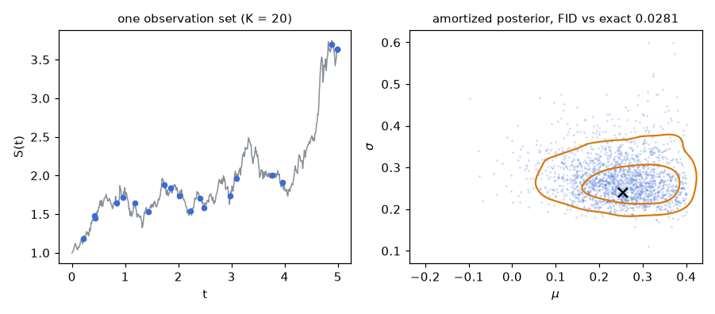

# The amortized posterior matches the exact GBM posterior at arbitrary observation points

The whole problem definition sits in the example script — a prior box, a simulator loop, an observation grid — and a small design-amortized posterior is trained on it for 1,200 optimizer steps on a laptop CPU, then queried on one fresh observation set: 20 points of a single path, placed at uniformly random times. For geometric Brownian motion the posterior on any such point set exists in closed form, and that referee is the only piece imported from the package. The comparison is quantitative: the run below reaches a squared Fréchet distance (FID) of 0.0281 between 2,000 amortized draws and 2,000 exact draws, where two independent 2,000-draw sets from the *same* distribution already score about 0.004.



*Left: the simulated price path (grey) with its 20 observed points (blue). Right: 2,000 draws from the amortized posterior (blue dots) over the highest-density regions of the exact conjugate posterior (orange contours); the black cross marks the generating $(\mu, \sigma)$, and the panel title carries the FID between the two sample sets.*

## The problem

$$dS = \mu S\,dt + \sigma S\,dW, \qquad S(0) = 1,$$

with a uniform box prior $\mu \in [-0.20,\ 0.40]$, $\sigma \in [0.10,\ 0.60]$. The simulator — the `GBM` class written out in [`01_quickstart_gbm.py`](../01_quickstart_gbm.py) and shown below — advances $\log S$ on a fine grid of 500 steps with $dt = 0.01$ (horizon $T = 5$) by $\Delta \log S = (\mu - \sigma^2/2)\,dt + \sigma\sqrt{dt}\,z$; since $\log S$ is Brownian motion with drift, this update coincides with the exact transition at the grid times.

An observation set (a *design*) is $K = 20$ grid times drawn uniformly at random from the 500 and time-sorted. The observed values are the raw prices at those times, with no observation noise (`obs_noise = 0` for this problem). The network receives the $K$ points as tokens and returns draws from $p(\mu, \sigma \mid \text{those points})$; the same network answers any design size in $[2, 128]$.

**The exact reference.** Prepend the known anchor $S(0)=1$ at $t_0 = 0$ and write $\tau_j = t_j - t_{j-1}$ for the gaps between consecutive observed times. The log-increments are independent Gaussians for any gap pattern,

$$r_j = \log S(t_j) - \log S(t_{j-1}) \;\sim\; \mathcal N\!\left(b\,\tau_j,\ \sigma^2 \tau_j\right), \qquad b = \mu - \tfrac{\sigma^2}{2},$$

so with $T = \sum_j \tau_j$, $R = \sum_j r_j$ and $\mathrm{SS} = \sum_j r_j^2/\tau_j - R^2/T$, the posterior over $(b, \sigma^2)$ is conjugate and `gbm_exact_from_points` draws it directly:

$$\sigma^2 = \frac{\mathrm{SS}}{\chi^2_{n-1}}, \qquad b \mid \sigma^2 \;\sim\; \mathcal N\!\left(R/T,\ \sigma^2/T\right),$$

then maps back $\mu = b + \sigma^2/2$ and importance-resamples the draws onto the uniform box prior in $(\mu, \sigma)$, with weights proportional to $\sigma$ inside the box and zero outside.

## The code, walked through

The central exhibit is the problem definition itself, complete in the script. A `DesignProblem` subclass states the prior, the grid metadata, and a batched simulator; nothing else is declared:

```python
class GBM(DesignProblem):
    """dS = mu S dt + sigma S dW, S0 = 1, observed at arbitrary times."""

    markov_observed = True      # observations determine the state exactly

    def __init__(self):
        self.prior = BoxUniform(low=[-0.20, 0.10], high=[0.40, 0.60],
                                names=["mu", "sigma"])
        self.observer = DesignObserver(dt_sim=0.01, n_steps=500, k_max=128)
        self.k_min = 2

    def trajectories(self, m, generator=None):
        B = m.shape[0]
        dt = self.observer.dt_sim
        mu, sigma = m[:, 0], m[:, 1]
        logS = torch.zeros(B)
        out = torch.zeros(B, self.observer.n_steps + 1, 1)
        out[:, 0, 0] = 1.0
        for i in range(self.observer.n_steps):
            z = torch.randn(B, generator=generator)
            logS = logS + (mu - 0.5 * sigma ** 2) * dt \
                + sigma * math.sqrt(dt) * z
            out[:, i + 1, 0] = torch.exp(logS)
        return out
```

`BoxUniform` is the prior; `DesignObserver` records the grid (step size, number of steps, the largest design size `k_max`); `trajectories` maps a `[B, 2]` parameter batch to `[B, 501, 1]` paths, threading the `generator` so runs are reproducible. Everything downstream — random-design training, tokenization, any-$K$ inference — is inherited from the base class.

Training is one `fit` call on the `"tiny"` named model size (width 32, two transformer blocks):

```python
post = model_of_size(prob, "tiny")
post.fit(n_train=3000, steps=1200, batch=256,
         retokenize=prob.make_retokenizer(), verbose=True)
```

The non-obvious argument is `retokenize`. The 3,000 training trajectories are simulated **once**, at full grid resolution; at every optimizer step the retokenizer re-observes each trajectory in the batch through a fresh random design — a new size $K$ (drawn from the package's mixed size law on $[2, 128]$: half log-uniform, half uniform over the dense half $[64, 128]$), new uniformly random times. One simulation therefore serves unboundedly many designs, and design memorization is impossible. Each observation becomes a six-feature token $[\,t/T,\ y,\ 0,\ 0,\ \log K/\log K_{\max},\ \text{channel}\,]$; the $\log K$ feature carries the design size, which attention cannot infer on its own.

The evaluation instance is fixed by seed — one parameter draw, one path, one design of 20 points:

```python
gen = torch.Generator().manual_seed(1)
m_true = prob.prior.sample(1, gen)
raw = prob.trajectories(m_true, gen)
tidx, cidx = prob.sample_design(gen, 20)
tokens = prob.tokens_for(raw[0], tidx, cidx, gen)

draws = post.sample(tokens, n=2000)                  # milliseconds
exact = gbm_exact_from_points(prob, raw[0, :, 0], tidx, n_samples=2000)

f = fid(draws.numpy(), exact)
```

`tokens_for` reads the raw path at the design's (time, channel) pairs, applies the problem's observation noise (none here), and normalizes times by the horizon — the same tokenization the retokenizer used in training, for a single set.

The referee, `gbm_exact_from_points` (in [`amortix/problems/design_basic.py`](../../../amortix/problems/design_basic.py)), conditions on exactly the observed points (duplicate indices are merged, the $S(0)=1$ anchor is prepended). Its sufficient statistics and conjugate draw, verbatim:

```python
idx = np.unique(np.concatenate([[0], np.asarray(tidx, dtype=np.int64)]))
vals = x[idx]
tau = np.diff(idx).astype(np.float64) * float(prob.observer.dt_sim)
r = np.diff(np.log(np.maximum(vals, 1e-12)))
n = r.size
T = float(tau.sum())
R1 = float(r.sum())
SSw = float((r ** 2 / tau).sum()) - R1 ** 2 / T
```

```python
chi = rng.chisquare(max(n - 1, 1), size=npool)
v = SSw / np.maximum(chi, 1e-300)
b = R1 / T + np.sqrt(v / T) * rng.standard_normal(npool)
sigma = np.sqrt(v)
d = np.stack([b + 0.5 * v, sigma], axis=1)
draws_all.append(d)
w_all.append(sigma * np.all((d >= low) & (d <= high), axis=1))
```

The importance correction onto the box prior is monitored: the candidate pool is grown until the effective sample size is a safe multiple of the request, and if it remains below the requested draw count the function raises instead of returning a degenerate reference.

## What comes out

The training trace of the recorded run (`cfm` is the flow-matching training loss; times in parentheses are cumulative seconds on one laptop CPU, indicative only):

```
[fit] simulating 3000 training trajectories (11 batches/epoch)...
  epoch   0  step     11  cfm 2.1326  (8.0s)
  epoch  10  step    121  cfm 1.3388  (145.5s)
  epoch  20  step    231  cfm 0.8757  (290.5s)
  epoch  30  step    341  cfm 0.8140  (422.2s)
  epoch  40  step    451  cfm 0.8320  (550.5s)
  epoch  50  step    561  cfm 0.8062  (678.2s)
  epoch  60  step    671  cfm 0.7896  (812.6s)
  epoch  70  step    781  cfm 0.8007  (948.1s)
  epoch  80  step    891  cfm 0.7746  (1125.8s)
  epoch  90  step   1001  cfm 0.7868  (1254.7s)
  epoch 100  step   1111  cfm 0.7740  (1383.9s)
  epoch 108  step   1199  cfm 0.7859  (1499.3s)
```

and the final printout:

```
true parameters : [0.25457894802093506, 0.23965543508529663]
posterior mean  : [0.24510666728019714, 0.2736765742301941]
FID vs exact    : 0.0281 (estimator floor at n=2000 is ~0.004)
```

Training takes about 25 minutes here (1499.3 s at the last logged step); sampling the 2,000 posterior draws afterwards takes milliseconds. The observation set and the reference are fixed by explicit seeds, so the true parameters and the exact posterior reproduce exactly; the trained network — and with it the posterior mean and the FID — varies slightly between platforms, which is why the test below asserts a ratio rather than this exact number.

## Why believe it

* [`tests/test_examples.py`](../../../tests/test_examples.py)`::test_gbm_beats_prior_fid` pins a shrunk version of this script — the `pico` model (width 8, two blocks), `n_train=1500`, 400 optimizer steps, the same seed-1 observation set — and requires the trained posterior's FID against the exact posterior to be at most half the FID of 2,000 prior samples against the same reference (`assert f_model <= 0.5 * f_prior`). The test imports the `GBM` class from this example file itself, so the problem it pins is the one shown above.
* The FID estimator is positive even for two draw sets from the same distribution, at order $d/n$; at $n = 2000$ this floor is about 0.004, so the run's 0.0281 is to be read against 0.004 as the value indistinguishable from a perfect match at this draw count, and against the much larger FID of prior samples pinned by the test.
* The reference guards its own validity: `gbm_exact_from_points` raises when the effective sample size of the importance correction stays below the requested draw count, so a degraded reference cannot silently enter the comparison.

## Run it

```bash
python examples/gallery/01_quickstart_gbm.py                 # train + compare, ~25 min
python examples/gallery/01_quickstart_gbm.py --png           # also render docs/media/quickstart_gbm.png
python examples/gallery/01_quickstart_gbm.py --ckpt gbm.pt   # save the model; later runs load it and skip training
```

Runtime from the recorded run (1499.3 s of training), one laptop CPU, indicative only. The script is [`01_quickstart_gbm.py`](../01_quickstart_gbm.py).

## References

* [arXiv:2503.01375](https://arxiv.org/abs/2503.01375) — the amortized-posterior method implemented by the package.
* [`report/techreport.pdf`](../../../report/techreport.pdf) — the evaluation methodology: reference construction and validation, the FID normalizations and floors, and the results across the full problem zoo.
